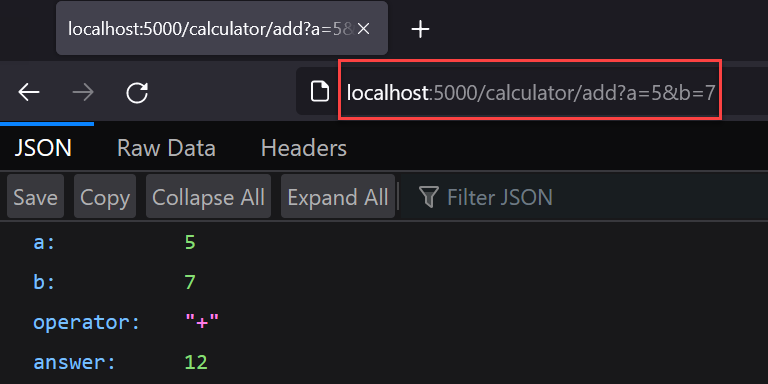
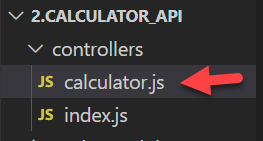
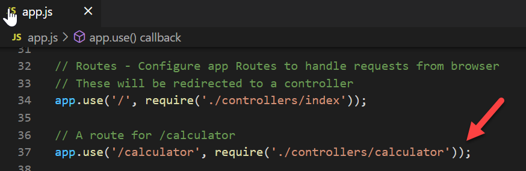

# Build a web API using Node and Express: Part 2

## Introduction

In the previous lab you built a very simple API with a single endpoint which
sent a JSON response to requests.

The next steps will build on part 1 by implementing an API endpoint which adds
two numbers, sent as request parameters. The API will perform the addition and
then send back the result as JSON data.


## Prerequisites

This tutorial continues from [part 1](./1.BuildANode&ExpressAPI_Part1.md).

## Add a new calculator controller

The calculator controller will contain the API endpoints for calculator requests. For example, **```/calculator/add```** to accept the client request to add two numbers.

The two numbers will be passed as a **query string** in the URL **```?a=5&b=7```**

The API endpoint will accept two parameters via the URL query string, validate, add the numbers, and return a result.

Here is what the request and result look like in a browser:



1.  Start by adding a new **controller** file, named **calculator.js** to the
    **controllers** folder. The new controller will contain the calculator
    endpoints.

    
    
2.  Following the previous example, add a new endpoint to handle to the default
    route in **controllers/calculator.js**

    ```javascript
    // This is the index controller
    // It defines an endpoint for the default route
    
    // Import router package
    const router = require('express').Router();
    
    /* Handle get requests for '/'
    /* this is the defult or 'index' route
    */
    router.get('/', (req, res) => {
        // Send a  response - this app will be a web api so no need to send HTML
        res.json({message: 'try calculator/add?a=5&b=7'});
    
    });
    
    // export
    module.exports = router;
    ```
    
    
    
3.  Add a new route for the controller in **app.js**

    
    
4.  Save and test the application:

    

### The addition endpoint

Requests for addition will be made to the **/calculator/add** endpoint. Add the API endpoint to the controller.

This endpoint function expects two parameters named a and b, sent as part of the URL,  for example

 **```/calculator/add?a=2&b=4```**.

The text after the **?** is known as the **query string** which can contain multiple parameters as **```name=value```** separated by **```&```**.

In the JS code you will see references to **```req.query.a```** and **```req.query.b```**, these refer to the request (URL), then the query string, and finally the named parameter.

If a value is missing, then it is considered **undefined**. Attempting to read an undefined value will cause an exception and so it is important to check that the values exist first.

#### The following endpoint for ```add``` goes in **```controllers\calcuator.js```** 
*See the code comments for more details.*

```javascript
/* Handle get requests for '/add'
/* this endpoint will read two values
/* process the two values
/* then send a response
*/
router.get('/add', (req, res) => {

    // define variables for values
    let numA;
    let numB;

    // read parameters from the querystring - if they exist
    if (typeof req.query.a != 'undefined')
        numA = req.query.a;
    
    if (typeof req.query.b != 'undefined')
        numB = req.query.b;

    // Call the calculatorService add function to perform addition
    const result = calc.add(numA, numB);

    // Send a  response
    res.json(result);

});
```


### The calculator service

It is good practice to separate code by function to improve readability, reduce errors, and ensure that the code is easier to maintain.

The role of the controller endpoint functions is to handle HTTP requests into the application and send responses and not to perform calculations. Instead of adding the numbers directly in the controller, a service will be used.

1.  Create a new folder in the application named **services**.

2.  Add a new file, **calculatorService.js**, to the services folder.

    

Add the following code (function + export) to **calculatorService.js**.

The **```add()```** function accepts two parameters which it validates and adds together.

The function returns a JavaScript containing the two input values, the **+** operator, and the sum of the two input values. See the code comments for details

```javascript
// The calculator service performs calculator functions
// such as add, subttract, multiply, divide, etc.

// Add two numbers passed as parameters
// Both params default to NaN (Not a Number) in case either value is missing

function add(a = NaN,b = NaN) {

    // Declare answer value
    let answer = NaN;

    // validation - make sure both values are numbers (i.e. not NaN)
    if (!isNaN(a) && !isNaN(b)) {
        a = Number(a);
        b = Number(b);
        answer = a + b;
    }

    // Return a JS Object containing the result
    return {
        "a": a,
        "b": b,
        "operator": "+",
        "answer": answer
    }
} // End add function

// Module exports
module.exports = {
    add
}
```


### Access the calculatorService from the calculator controller

The final part of the service is a **```module.exports```** which defines the functions which may be imported in other parts of the application. This makes the service easier to re-use if required.

Here is the completed **/controllers/calculator.js**. Note that the service is ‘required’ and assigned to the **```calc```** variable.

Further down **```const result = calc.add(numA, numB)```** calls the **add function** and assigns the **result** which is returned in a response

```javascript
// This is the calculator controller

// Import router package
const router = require('express').Router();

// Import the calculator service
const calc = require('../services/calculatorService.js');

/* Handle get requests for '/'
/* this is the defult or 'index' route
*/
router.get('/', (req, res) => {
    // Send a  response - this app will be a web api so no need to send HTML
    res.json({message: 'try calculator/add?a=5&b=7'});

});

/* Handle get requests for '/add'
/* this endpoint will read two values
/* process the two values
/* then send a response
*/
router.get('/add', (req, res) => {

    // define variables for values
    let numA;
    let numB;

    // read parameters from the querystring - if they exist
    if (typeof req.query.a != 'undefined')
        numA = req.query.a;
    
    if (typeof req.query.b != 'undefined')
        numB = req.query.b;

    // Call the calculatorService add function to perform addition
    const result = calc.add(numA, numB);

    // Send a  response
    res.json(result);

});

// export
module.exports = router;

```


### Save, run, and Test the API

Browser output for
[http://localhost:8080/add?a=5&b=](http://localhost:8080/add?a=5&b=2)7


## Exercises:

1.  Following the example, add calculator endpoints for the other functions -
    subtract, multiply, and divide.

------

Enda Lee 2022
